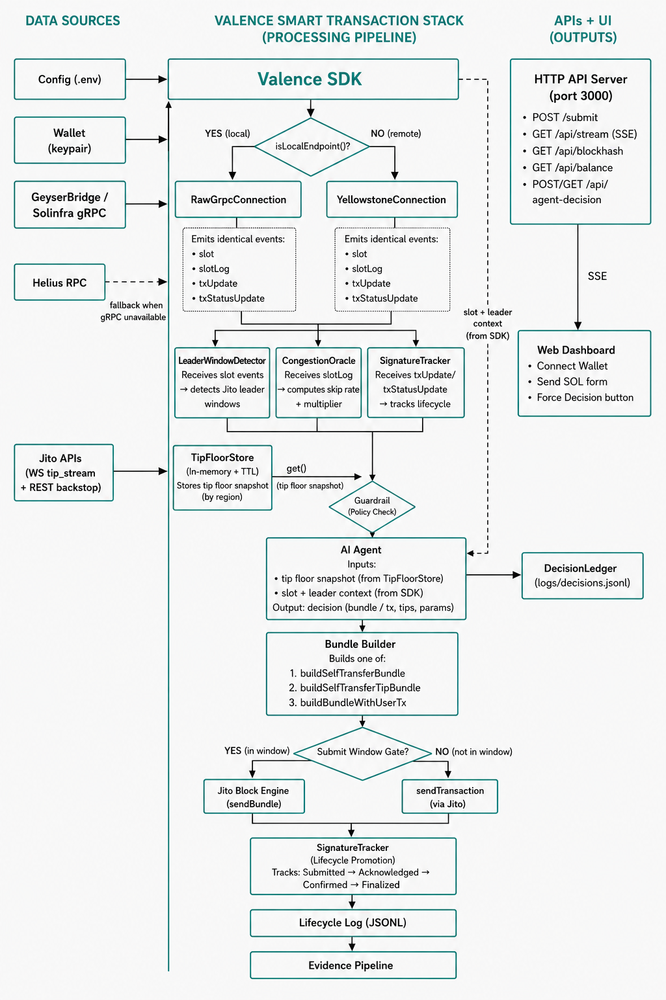
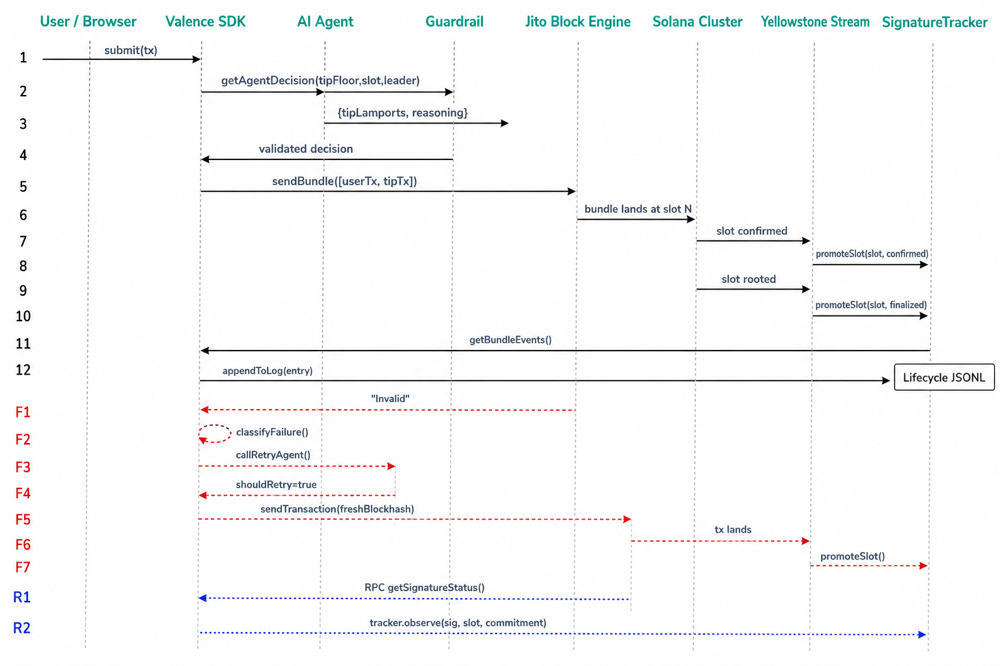
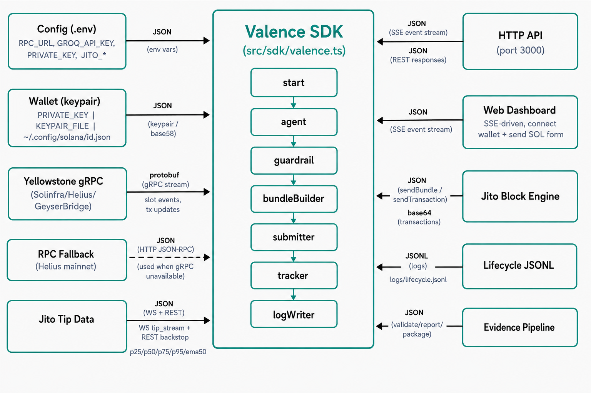

# Valence - Smart Transaction Stack Architecture

> Architecture document for the Valence smart transaction stack on Solana.

---

## 1. System Overview



---

## 2. Bundle Lifecycle Sequence



---

## 3. Component Responsibilities

### 3.1 Valence SDK (`src/sdk/valence.ts`)

The top-level `Valence` class that wires together all subsystems behind a unified API. Used by the CLI, HTTP server, daemon, and third-party integrators.

```
Valence
├── start()                    — initializes wallet, RPC, gRPC, leader detector, tip floor, oracle
├── submit(input, options?)    — builds bundle, calls AI agent, submits via Jito, tracks lifecycle
├── getAgentDecision()         — calls tip agent with live data, no transaction (Force Decision)
├── status()                   — returns SdkStatus (slot, balance, congestion, stream state)
├── getTracker()               — SignatureTracker reference
├── getRpc()                   — RPC client reference
├── getTipFloorStore()         — tip floor snapshot reference
├── getLeaderDetector()        — leader window detector reference
├── getCurrentSlot()           — last seen slot
└── stop()                     — disconnects gRPC, stops tip store
```

**Dual gRPC selection**: On `start()`, if `YELLOWSTONE_ENDPOINT` is configured, `isLocalEndpoint()` checks whether it points at localhost. Local endpoints use `RawGrpcConnection` (raw `@grpc/grpc-js`); remote endpoints use `YellowstoneConnection` (NAPI `@triton-one/yellowstone-grpc`). If gRPC connect fails, the system degrades gracefully to RPC polling — slot and transaction data is fetched via RPC with lifecycle tracking still functioning.

**Agent call flow** (`executeSubmit`):
1. Fetch fresh blockhash (`processed` commitment)
2. Get current tip accounts from Block Engine
3. Call `callTipAgent()` with tip floor snapshot, current slot, leader identity, bundle size
4. Clamp agent's tip to `[1000, maxTipLamports]`
5. Build bundle (self-transfer or user tx + tip tx)
6. Simulate bundle, submit via `sendBundle`, fall back to `sendTransaction`
7. Track lifecycle stages: submitted → confirmed → finalized
8. On failure (`maxRetries > 0`): call `callRetryAgent()`, refresh blockhash, resubmit

### 3.2 HTTP API Server (`src/server.ts`)

Built-in HTTP server on port 3000 using Node.js `http.createServer`. No framework dependency.

| Endpoint | Method | Description |
|---|---|---|
| `/` | GET | Web dashboard (static HTML) |
| `/submit` | POST | Submit a transaction. Body: `{ transaction: base64, urgency?, tipCeilingLamports?, maxRetries? }` |
| `/health` | GET | Health check — returns status with 200 or 503 |
| `/readyz` | GET | Readiness check — returns 200 when initialized |
| `/api/status` | GET | Full system status |
| `/api/stream` | GET | SSE endpoint — pushes status JSON every 1s |
| `/api/blockhash` | GET | Fresh blockhash for frontend tx building |
| `/api/balance` | GET | `?address=` — returns balance via RPC proxy |
| `/api/agent-decision` | POST/GET | Forces an agent decision with live data |

### 3.3 Web Dashboard (`web/index.html`)

Single-file static HTML dashboard served at `/`. Features:
- **SSE-driven live updates**: connects to `/api/stream`, displays slot, congestion, tip floor percentiles, landed/failed counters in real time
- **Wallet connection modal**: detects Phantom, Backpack, Solflare, Glow, OKX, Trust via their `window.solana.is*` properties. Opens a selection modal before connecting.
- **Send SOL form**: destination address + amount inputs. Flow: fetch blockhash from `/api/blockhash` → build `solanaWeb3.Transaction` → sign with `window.solana.signTransaction()` → POST signed tx to `/submit` → backend wraps it with a tip tx in a Jito bundle
- **Force Decision button**: calls `/api/agent-decision` and displays the agent's live tip + reasoning

### 3.4 CLI / Daemon (`src/cli.ts`, `src/daemon.ts`)

**CLI** (`src/cli.ts`): dispatches subcommands via argv parsing:
- `submit` — single submission
- `server` — starts HTTP API server
- `daemon` — continuous operation with TUI dashboard
- `preflight` — runs readiness checks
- `evidence-validate` / `evidence-report` / `evidence-package` / `evidence-readiness` — evidence pipeline

**Daemon** (`src/daemon.ts`): runs Valence continuously with:
- Yellowstone gRPC streaming
- Leader window detection with periodic heartbeats
- Automatic submission loop
- Terminal UI dashboard (ANSI escape codes, boxed panels)
- Optional embedded HTTP API (`--server` flag)

### 3.5 Congestion Oracle (`src/network/congestion.ts`)

`class CongestionOracle` — a 64-slot sliding window that measures network congestion from two signals:
- **Skip rate**: fraction of slots where the leader failed to produce a block (detected via Yellowstone slot stream gaps)
- **P→C delta**: processed-to-confirmed latency p50 (how long the cluster takes to reach supermajority vote)

Produces a single `multiplier` that scales the agent's tip during congested periods. The multiplier is 1.0 at baseline (skip rate < 5%, P→C delta < 700ms) and increases linearly up to 3.0 during congestion.

### 3.6 YellowstoneConnection (`src/yellowstone/connection.ts`, `src/yellowstone/raw.ts`)

**Two implementations** selected automatically:

| Aspect | YellowstoneConnection (NAPI) | RawGrpcConnection (raw) |
|---|---|---|
| Library | `@triton-one/yellowstone-grpc` | `@grpc/grpc-js` + `@grpc/proto-loader` |
| Use case | Remote (Solinfra, Helius) | Localhost (GeyserBridge) |
| Events | slotLog, txUpdate, txStatusUpdate, latencySample, fromSlotReplay, connected, disconnected, reconnecting, error | slot, slotLog, txUpdate, txStatusUpdate, connected, disconnected, error |
| Reconnect | `ReconnectBackoff` — exponential backoff with jitter | Linear backoff (1-3s) with jitter |
| From-slot replay | Supports `fromSlot` to backfill on reconnect | Not supported |
| Latency sampling | Yes — compares gRPC slot vs RPC `getSlot()` | Not supported |
| Proto version | protobuf-es (NAPI) | proto-loader (compatible with GeyserBridge) |

**Selection** (`isLocalEndpoint()` in `src/yellowstone/raw.ts`): checks if the endpoint host is `localhost`, `127.0.0.1`, or `0.0.0.0` — raw gRPC is used for local dev (GeyserBridge), NAPI for production gRPC providers.

Both extend `EventEmitter` and share:
- `connect()` / `disconnect()` / `isConnected()`
- `setWalletPubkey(pubkey)`
- Events: `slot`/`slotLog`, `txUpdate`, `txStatusUpdate`, `connected`, `disconnected`, `error`

### 3.7 LeaderWindowDetector (`src/yellowstone/leader/detector.ts`)

- Receives live slot updates from Yellowstone
- Cross-references against the leader schedule from `fetchLeaderSchedule` (RPC `getLeaderSchedule`)
- Detects: upcoming Jito leader, leader window entered, leader window passed
- Adapts detection horizon dynamically via `computeHorizon()` — median of last 10 inter-slot intervals, max 300 slots
- Emits: `leaderDetected`, `leaderEntered`, `leaderPassed`, `heartbeat`, `horizonAdapted`
- **Submit-window gating**: `inSubmitWindow` getter returns `true` only when the current or next 2 scheduled leaders include a Jito-Solana validator. `sendBundle` is skipped when `false`, falling through to `sendTransaction` immediately.
- **Jito validator discovery** (`src/yellowstone/leader/schedule.ts`): `fetchJitoValidatorKeys()` queries the Kobe API (`https://kobe.mainnet.jito.network/api/v1/validators`) and cross-references against RPC vote accounts for a more complete validator list than manual env var configuration.

### 3.8 TipFloorStore (`src/jito/snapshot.ts`)

- Seeds initial percentile data from REST endpoint (`bundles.jito.wtf/api/v1/bundles/tip_floor`) on startup
- Subscribes to live WebSocket `tip_stream` for updates via `TipStreamClient`
- REST backstop polling (configurable interval, default 10s) when WS disconnects
- Provides `get()` snapshot for the Groq agent

### 3.9 Bundle Builder (`src/jito/bundle.ts`)

Three bundle construction functions:

| Function | Description | Use Case |
|---|---|---|
| `buildSelfTransferBundle` | 2 transactions: self-transfer + tip transfer | Backend-wallet-only submissions (volume runner) |
| `buildSelfTransferTipBundle` | 1 combined transaction: self-transfer + tip | Single-tx fallback path |
| `buildBundleWithUserTx` | User-signed tx + backend-signed tip tx | Wallet-first flow (browser → Valence) |

`buildBundleWithUserTx(userTxBase64, wallet, tipAccount, blockhash, tipLamports)`:
1. Deserializes the user's signed base64 transaction
2. Extracts the user's signature
3. Builds a tip transaction (self-transfer + tip transfer) signed by the backend wallet
4. Returns bundle `[userTx, tipTx]` — both are submitted atomically to Jito

All builders output `{ bundle: string[], signatures: string[], transactions: VersionedTransaction[] }`.

### 3.10 Submission Pipeline (`src/jito/submission.ts`, `src/jito/searcher.ts`)

- Primary: `submitBundle` (REST) or `sendBundleViaGrpc` (gRPC) → `getInflightBundleStatuses` (up to 25s)
- Fallback: `sendViaBlockEngine` (sendTransaction) + on-chain polling (60s)
- Rate-limit aware: retries 429 responses with backoff (5 attempts)
- Simulation before every submission
- gRPC searcher client (`src/jito/searcher.ts`): raw `@grpc/grpc-js` client using `searcher.proto`, provides `sendBundleViaGrpc()` and `getNextScheduledLeader()` for lower-latency bundle submission

### 3.11 SignatureTracker (`src/lifecycle/tracker.ts`)

- In-memory Map of watched signatures with independent commitment progression
- `recordSubmitted`: stores bundle metadata (signatures, tip, slot, reasoning)
- `observe`: updates commitment level (never downgrades). Each commitment level (`processed`, `confirmed`, `finalized`) is stored independently in a `stages` map, so all observed stages are preserved.
- **Slot-level commitment promotion**: `promoteSlot(slot, commitment)` advances every signature that landed in a given slot to the specified commitment level. Called from the Yellowstone `slot` event handler — when a slot reaches `confirmed` or `root` (finalized), all tracked signatures in that slot are promoted to the corresponding stage without RPC polling.
- `getBundleEvents`: reconstructs full lifecycle from all observed stages per signature, emitting one event per observed commitment level.
- Bundles map keys: bundleId → signatures → each sig's tracked events

### 3.12 Lifecycle Log Writer (`src/lifecycle/logWriter.ts`)

- `createLifecycleLogEntry`: builds structured entry with computed stage deltas
- `appendToLog`: appends JSON line to the JSONL file
- Used both for original submissions and retry entries (separate lines)

### 3.13 Failure Classifier (`src/jito/failureClassifier.ts`)

- `classifyFailure`: maps error strings to 5 classification types
- `classifyBundleStatus`: maps bundle status payloads
- `classifyTransactionError`: maps transaction-level errors
- Sources: simulation errors, bundle status payloads, sendTransaction errors, fallback tx not observed on-chain

### 3.14 Retry Loop (`src/jito/retry.ts`)

- Triggered post-failure when `maxRetries > 0`
- Calls `callRetryAgent` for decision (shouldRetry + new tip + reasoning)
- Falls back to hardcoded retry with original tip if no Groq key
- Fresh blockhash, tip account, and bundle per attempt
- Returns `{ success, finalBundleId }`

### 3.15 AI Agent Ecosystem

Three agent functions serve different operational decisions:

#### `callTipAgent` (`src/agent/groqClient.ts`)
- **Purpose**: Decide the Jito bundle tip in lamports
- **Input**: tip floor snapshot (p25/p50/p75/p95/p99/ema50), current slot, leader identity, isJitoLeader, bundle size, tip account
- **Output**: `{ tipLamports, reasoning }`
- **API**: Groq LLaMA 3.1 8B via OpenAI-compatible function calling
- **Clamping**: output clamped server-side to `[1000, maxTipLamports]`

#### `callRetryAgent` (`src/agent/retryClient.ts`)
- **Purpose**: Decide whether and how to retry after a bundle failure
- **Input**: failure classification, original tip, failure context (slot, leader, tip floor)
- **Output**: `{ shouldRetry, tipLamports, reasoning }`
- **Triggered by**: the retry loop in `src/jito/retry.ts`

#### `callAgent` (`src/agent/agent.ts`)
- **Purpose**: Full retry intelligence with detailed diagnosis and guardrail integration
- **Input**: `AgentContext` (failure type, attempt count, slot, leader, tip floor, previous decisions)
- **Output**: `AgentDecision` (diagnosis, rootCause, action, params with refreshBlockhash/newTipLamports/tipPercentileTarget/submitAtSlot/maxBlockhashAgeSlots, confidence, expectedOutcome)
- **Contract**: defined in `contract.ts` with strict-JSON schema and validation
- **Guardrailed**: output passes through `validateDecision()` / `correctDecision()` before execution

### 3.16 Agent Guardrails (`src/agent/guardrail.ts`)

`validateDecision(decision)` checks:
- `newTipLamports` ∈ [1000, 100000]
- `maxBlockhashAgeSlots` ≤ 150
- `submitAtSlot` > `currentSlot` (future slot)
- If action is `retry`, `refreshBlockhash` must be true
- `diagnosis` length ≥ 10 characters
- `confidence` ∈ [0, 1]

`correctDecision(decision, currentSlot)` fixes out-of-bounds values by clamping to valid ranges. If correction is impossible (e.g., invalid action), returns a fallback decision.

### 3.17 Decision Ledger (`src/agent/ledger.ts`)

`class DecisionLedger` — append-only JSONL audit trail at `logs/decisions.jsonl`.
Each entry records:
- Full agent input context
- Raw LLM reasoning
- Validated decision (post-guardrail)
- Guardrail actions (none/clamped/corrected)
- Executed action
- Eventual outcome (landed/failed)

### 3.18 Evidence System (`src/evidence/`)

Validates and packages lifecycle logs for compliance:

| Function | Purpose |
|---|---|
| `validateEvidence()` | Validates JSONL structure, hash-chain integrity, field completeness |
| `checkReadiness()` | Checks >= 10 rows, landings observed, failures present |
| `computeSourceHash()` | SHA-256 hash of entire evidence file |
| `generateReport()` | Produces `EvidenceManifest` + Markdown audit report |

Each evidence row includes:
- Hash-chain integrity (each row references previous row's hash)
- Bundle ID != signature (anti-fabrication)
- `confirmedVia: "stream"` (stream-primary confirmation)
- Agent decision snapshots with prompt/observation hashes
- Stage deltas and failure classification

### 3.19 RPC Client (`src/rpc/client.ts`, `src/rpc/errors.ts`)

`createRpcClient(config)` wraps `@solana/web3.js` `Connection` with:
- Timeout (30s default)
- Retry (3 attempts, linear backoff)
- Typed errors: `RpcConnectionError`, `RpcRateLimitError`, `RpcTimeoutError`
- Methods: `getBalance(pubkey)`, `getSlot(commitment?)`, `getLatestBlockhash(commitment?)`, `getConnection()`

### 3.20 Wallet Loader (`src/wallet/loader.ts`)

`loadWallet(config)` loads a Solana keypair from three sources (in priority order):
1. `PRIVATE_KEY` env var (base58-encoded secret key)
2. `KEYPAIR_FILE` env var (filesystem path to JSON keypair)
3. `~/.config/solana/id.json` (default Solana CLI keypair)

### 3.21 Congestion Oracle (`src/network/congestion.ts`)

`class CongestionOracle` tracks:
- **Slot skip rate**: fraction of slots (over 64-slot window) where the expected slot update was not received from Yellowstone. Computed as `skipped / (skipped + received)`. Indicates leader failures or network degradation.
- **P→C delta**: processed-to-confirmed latency p50 for transactions tracked by SignatureTracker. Measures how long the cluster takes to reach supermajority vote.
- **Multiplier**: `1 + 2 × min(skipRate / 0.2, pcDeltaMs / 1000, 1)`. At baseline (skip < 5%, delta < 200ms), multiplier is ~1.0. Under severe congestion, approaches 3.0.
- The multiplier is surfaced to the AI agent via `getStatus()` and can be referenced in the tip decision prompt.

### 3.22 Volume Runner (`src/index.ts`)

- Sequential loop when `volumeCount > 1`
- Cycles failure modes: clean → expiry → low_tip → compute_exceeded → repeat
- Sleeps `volumeIntervalMs` between submissions
- Shared SignatureTracker across all submissions
- Prints summary: `X succeeded, Y failed (out of Z)`

### 3.23 TUI Dashboard (`src/tui/dashboard.ts`)

`class Dashboard` — terminal UI with zero external dependencies (pure ANSI escape codes).
Panels:
- **Network**: current slot, connection status, stream state
- **Congestion**: skip rate %, P→C delta ms, multiplier
- **Tip Floor**: p25/p50/p75/p95/ema50 with sparkline
- **Bundles**: landed/failed counts, recent submissions
- **AI Agent**: last decision and reasoning
- **Logs**: scrollable event log

### 3.24 Config System (`src/config/env.ts`, `src/types/config.ts`)

`loadConfig()` reads from environment variables (via dotenv) and returns a validated `ValenceConfig` with 27 fields:

| Category | Variables |
|---|---|
| Network | `RPC_URL`, `YELLOWSTONE_ENDPOINT`, `YELLOWSTONE_GRPC_TOKEN` |
| Wallet | `PRIVATE_KEY`, `KEYPAIR_FILE` |
| Jito | `JITO_BLOCK_ENGINE_URL`, `JITO_TIP_FLOOR_URL`, `JITO_TIP_STREAM_URL`, `JITO_VALIDATOR_KEYS` |
| Agent | `GROQ_API_KEY`, `GROQ_MODEL`, `GROQ_ENDPOINT` |
| Submission | `SEND_BUNDLE`, `BUNDLE_TIP_LAMPORTS`, `MAX_TIP_LAMPORTS`, `MAX_RETRIES` |
| Volume | `VOLUME_COUNT`, `VOLUME_INTERVAL_MS`, `INJECT_FAILURE_MODE`, `INTENTIONAL_EXPIRY` |
| Monitoring | `SHOW_TIP_DATA`, `LEADER_HEARTBEAT_INTERVAL`, `LIFECYCLE_LOG_PATH` |

---

## 4. Infrastructure Decisions

| Decision | Choice | Rationale |
|---|---|---|
| Network | Mainnet only | Devnet Block Engine unreliable; explorer verification requires mainnet. |
| Agent mode | Tip Intelligence | Clearest measurable decision with real data feed. |
| Language | TypeScript / Node.js | SDK maturity (Jito, Yellowstone both have first-class TS). |
| Agent runtime | Groq | Sub-second latency on the hot path between bundle assembly and submission. |
| Lifecycle log | JSONL file | Simple, append-only, no database, easy to include in repo. |
| Blockhash commitment | `processed` (normal), `finalized` (intentional expiry) | Maximizes valid window; expiry mode demonstrates the tradeoff. |
| Bundle strategy | sendBundle → sendTransaction (submit-window gated) | `sendBundle` only attempted when a Jito leader is current or ≤2 slots away; otherwise skips directly to `sendTransaction`. Mitigates Block Engine "Invalid" responses and saves time. |
| gRPC connection | Dual: NAPI for remote, raw gRPC for localhost | NAPI module has ESM/CJS loading issues; raw gRPC works reliably with local GeyserBridge instances. |
| HTTP API | Node.js built-in `http` module | No framework dependency, single-process deployment, SSE for real-time dashboard. |
| SDK-first architecture | `class Valence` wraps all subsystems | Enables programmatic use across CLI, server, daemon, tests, and third-party integrations. |
| Congestion signals | Skip rate + P→C delta | Two independent signals that together distinguish leader failures from cluster-wide congestion. |
| Agent guardrails | Server-side clamping + validation | Prevents agent errors from causing financial or operational damage. |
| Decision audit trail | Append-only JSONL (DecisionLedger) | Compliance and debugging; no database dependency. |
| Evidence validation | SHA-256 hash chains | Verifiable proof that lifecycle entries were generated sequentially and have not been tampered with. |
| RPC client | Wrapped with timeout/retry/typed errors | Fail-fast on network issues, consistent error handling throughout the stack. |
| Leader detection horizon | Dynamic (median of last 10 intervals, max 300) | Adapts to varying slot production rates; 300-slot cap prevents missing leaders when network is slow. |
| Jito validator discovery | Kobe API + RPC vote accounts | More comprehensive validator list than manual env var configuration. |
| Tip data source | WebSocket stream + REST backstop | Redundant data paths for reliability; WS preferred, REST fallback on disconnect. |
| User tx bundling | `buildBundleWithUserTx` separate from self-transfer | Enables wallet-first flow without giving the backend custody of user funds. |
| Web dashboard | Static HTML + SSE | Zero build step, no framework, works with any browser. |

---

## 5. AI Agent Guardrails and Risk Posture

### Guardrail System (`src/agent/guardrail.ts`)

Every agent decision passes through a two-stage guardrail before execution:

**Stage 1 — Validation**: `validateDecision(decision, currentSlot)` checks:
- `newTipLamports` ∈ [1000, 100000] — agent cannot set a tip outside this range
- `maxBlockhashAgeSlots` ≤ 150 — prevents using stale blockhashes
- `submitAtSlot` > currentSlot — prevents submitting to past slots
- If action is `retry`, `refreshBlockhash` must be true — ensures fresh blockhash on retry
- `diagnosis` length ≥ 10 — prevents empty/trivial reasoning
- `confidence` ∈ [0, 1] — valid probability

**Stage 2 — Correction**: `correctDecision(decision, currentSlot)`:
- Clamps `newTipLamports` to [1000, 100000]
- Clamps `maxBlockhashAgeSlots` to [1, 150]
- Sets `submitAtSlot` to `currentSlot + 1` if it's in the past
- Sets `refreshBlockhash = true` if action is `retry`
- If the decision is fundamentally invalid (wrong action type, missing fields), returns a safe fallback:
  ```json
  { "diagnosis": "Fallback: guardrail could not correct invalid decision",
    "rootCause": "unknown", "action": "retry",
    "params": { "refreshBlockhash": true, "newTipLamports": 10000,
      "tipPercentileTarget": 50, "submitAtSlot": currentSlot + 1,
      "maxBlockhashAgeSlots": 60 },
    "confidence": 0.5, "expectedOutcome": "retry with fallback parameters" }
  ```

### Risk Controls

- **Tip clamping**: The agent's tip decision is clamped server-side to `[1000 lamports, maxTipLamports]`. The agent cannot drain the wallet.
- **Retry bounds**: The retry loop is bounded by `maxRetries` (0–10, default 3). The agent can decide not to retry, but the loop cannot exceed this ceiling.
- **Keypair safety**: The private key is loaded from env or file, never hardcoded, never exposed to the agent. The agent receives only tip-floor data and slot/leader context.
- **Failure injection**: `INTENTIONAL_EXPIRY` and `INJECT_FAILURE_MODE` are env-gated. The agent cannot trigger failure modes.
- **Financial exposure**: With `maxTipLamports` at 10,000 lamports and `volumeCount` at the configured value, worst-case spend is bounded by `volumeCount × (5000 fee + maxTipLamports)`. A full 10-bundle run costs at most ~0.0015 SOL.
- **Decision audit trail**: Every agent interaction is recorded in `logs/decisions.jsonl` with input context, raw reasoning, validated output, and eventual outcome.

---

## 6. Data Flow Summary



